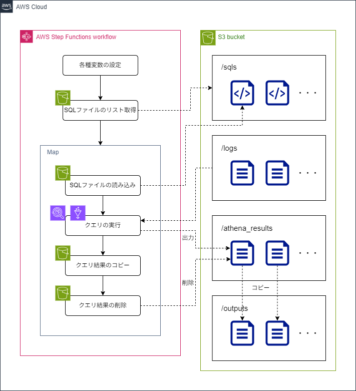

# Athena ETL パイプライン

AWS Athena を使用した ETL (Extract, Transform, Load) パイプラインの Terraform 構成です。このプロジェクトでは Step Functions を使用して S3 バケットに保存された SQL クエリを自動実行し、結果を整理して保存します。

## アーキテクチャ



- **AWS Step Functions**: ETL ワークフローのオーケストレーション
- **Amazon Athena**: SQL クエリの実行エンジン
- **Amazon S3**: データの保存とクエリ結果の出力
- **AWS Glue**: データカタログ管理

## 前提条件

- AWS アカウント
- AWS CLI (設定済み)
- VS Code (推奨)

## セットアップ

1. Codespaces か Devcontainer で環境を立ち上げます:

    - [Codespaces のドキュメント - GitHub Docs](https://docs.github.com/ja/codespaces)
    - [Developing inside a Container](https://code.visualstudio.com/docs/devcontainers/containers)

1. AWS プロファイルを設定します:

    ```bash
    aws configure --profile athena-etl
    ```

1. `main.tf` ファイルでバケット名を更新します:

    ```terraform
    terraform {
        backend "s3" {
        bucket  = "あなたのバケット名"  # ★★★replace_me★★★ を実際のバケット名に更新
        key     = "athena-etl/terraform.tfstate"
        profile = "athena-etl"
        region  = "ap-northeast-1"
        }
        # ...
    }
    ```

## 使用方法

### Terraform の初期化とデプロイ

```bash
cd /workspace/iac
terraform init
terraform plan
terraform apply
```

### StepFunctionsの実行

[Step Functions](https://ap-northeast-1.console.aws.amazon.com/states/home?region=ap-northeast-1#/statemachines) > terraform構築済みのステートマシン > `実行を開始` 押下

## ディレクトリ構造

```
.
├── .devcontainer/ - 開発コンテナの設定
├── iac/
│   ├── jsonata/   - JSONata 変換処理
│   ├── main.tf    - Terraform 設定
│   └── resources.tf - リソース定義
└── compose.yaml  - Docker Compose 設定
```

## リソース

- S3 バケット: ETL データ、SQL ファイル、結果の保存
- Step Functions: ETL ワークフローの実行
- Glue Database & Tables: データカタログ
- Athena Workgroup: クエリ実行環境

## ライセンス

[MIT](LICENSE)
